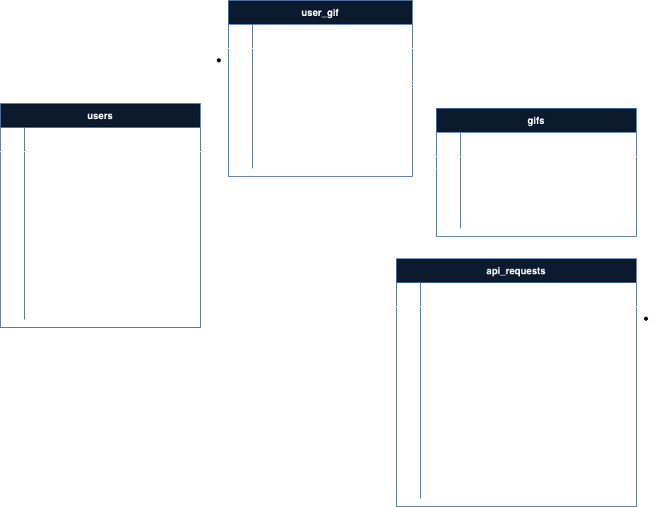

## Sobre el proyeto

Este proyecto se integra a una API existente [GHIPY](https://developers.giphy.com/docs/api/#quick-start-guide) y expone a través de endpoint algunos de sus servicios.

- Esta aplicación es una API RESTFull.
- Brinda los siguientes servicios a partir de endpoints 
  - login para poder utilizar los servicios.
  - search para buscar un gif utilizando palabras que hagan match con alguna propiedad de los mismos.
  - getById para obtener un gif específico.
  - save para guardar el id de un gif y vincularlo al usuario.
## Diagrama de secuencia

## Características esenciales 

- El proyecto cuenta con la configuración necesaria para realizar el deploy mediante DOCKER-COMPOSE.
- El proyecto cuenta con la configuración necesaria en el archivo .env.example para acceder a una base de datos MariaDB dentro del contenedor.

## Packages adicionales
- **laravel/passport**

## Despliegue
- Tener instalado y configurado docker y docker-compose en el entorno a realizar el despliegue.
- Clonar el repositorio en el directorio deseado ``git clone git@github.com:matiasgonzalo/gifs.git matiAcostaGifsProyect``
- Acceder al directorio del proyecto y copiar el archivo **.env.example** y renombrarlo por **.env**
- Construir y levantar el contenedor con los recursos necesarios ``docker-compose up -d``
- Ingresar al directorio del proyecto y luego al contenedor ``docker-compose exec webapp bash``
- Instalar dependencias: ``composer install``
- Ejecutar ``php artisan key:generate``
- Ejecutar migraciones y seeders con datos de prueba: ``php artisan migrate --seed``
- Instalar passport: ``php artisan passport:install`
- Se creará el usuario **matias@gmail.com** y **melanie@gmail.com** con la password ``password``

## Diagramas de secuencia
#### Login

#### Search

#### GetById

#### store

#### DER

### Postman Collection

- **[Link Invite](https://app.getpostman.com/join-team?invite_code=fffe514ceb3c17f49526fdfb1b2febd1&target_code=90656fcf47b501afca75ad68a5589139)**
- **[Link a la colección abierta](https://www.postman.com/supermarket2022/workspace/gifs/overview)**

#### Descripción de Endpoints

- Se realiza el login de usuario (POST): **[http://localhost:8098/api/v1/login](http://localhost:8095/api/v1/login)**
- Ejemplo:
`curl --location 'http://localhost:8098/api/v1/login' \
  --header 'Accept: application/vnd.api+json' \
  --form 'email="matias@gmail.com"' \
  --form 'password="password"'`
- Se realiza la búsqueda de gifs (GET): **[http://localhost:8098/api/v1/gifs/search?query=Mati&limit=1](http://localhost:8098/api/v1/gifs/search?query=Mati&limit=1)**
- Ejemplo:
`curl --location 'http://localhost:8098/api/v1/gifs/search?query=Mati&limit=1' \
  --header 'Accept: application/vnd.api+json' \
  --header 'Authorization: BearerToken`
- Se realiza la búsqueda de un gif específico (GET): **[http://localhost:8098/api/v1/gifs/get-by-id?id=APqEbxBsVlkWSuFpth](http://localhost:8098/api/v1/gifs/get-by-id?id=APqEbxBsVlkWSuFpth)**
`curl --location 'http://localhost:8098/api/v1/gifs/get-by-id?id=APqEbxBsVlkWSuFpth' \
  --header 'Accept: application/json' \
  --header 'Authorization: BearerToken`
- Se guarda el id de un gif y se lo vincula al usuario autenticado (POST): **[http://localhost:8098/api/v1/gifs/user/1](http://localhost:8098/api/v1/gifs/user/1)**
`curl --location 'http://localhost:8098/api/v1/gifs/user/1' \
  --header 'Accept: application/json' \
  --header 'Authorization: BearerToken`

#### Confiración de guardado automático de token

- Si no es posible visualizar la colección en postman, es posible importar las peticiones curl ingresando al menú ``File->import``
- Para configurar el guardado automático de token es necesario:
  - Crear la variable de entorno ``bearer_token``
  - Ingresar en postman al enpoint ``login`` en la carpeta User.
  - Ingresar a la pestaña ``Tests`` y pergar el siguiente código:
  ``var extractedData = pm.response.json();
    postman.setEnvironmentVariable("bearer_token",  extractedData.data.access_token);``
  - En todos los endpoints:
    - Seleccionar la pestaña Authorization
    - Seleccionar el type Bearer Token
    - Pegar la variable ``{{bearer_token}}``

## Tests

- Acceder al contenedor: ``docker-compose exec webapp bash``
- Ejecutar todos los test automáticos: ``./vendor/bin/phpunit``
- Ejecutar test de clases especificas: ``./vendor/bin/phpunit --filter GetByIdGifTest``
- Ejecutar test de funciones especificas: ``./vendor/bin/phpunit --filter GetByIdGifTest::an_authenticated_user_can_get_by_id_a_gif_with_id_param``

## Autor

Este proyecto fue desarrollado por [Acosta Matias Gonzalo](https://github.com/matiasgonzalo)
